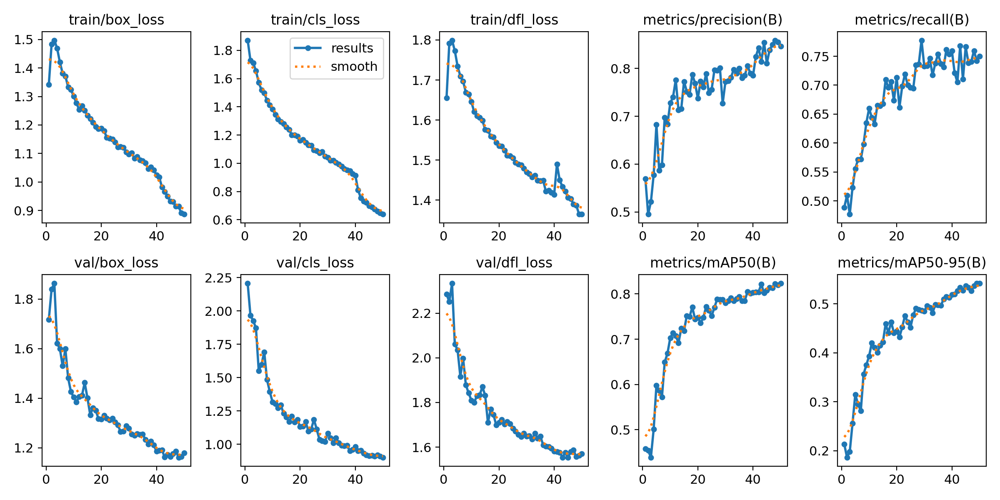
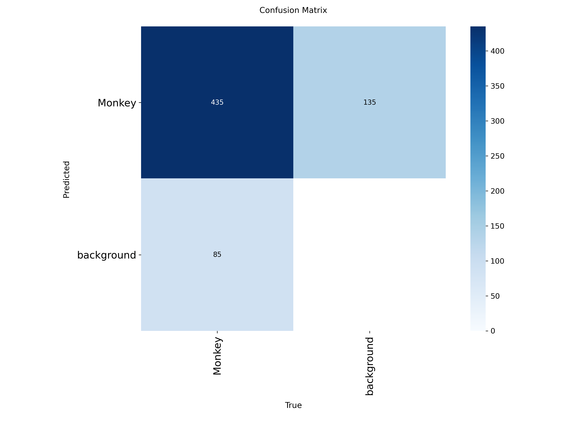

# Monkey Detection with YOLOv8

A real-time object detector that finds monkeys in a live camera feed or a video file. The model is a YOLOv8n (nano) detector fine-tuned on a custom monkey dataset, built to support a low-cost, non-invasive way of spotting monkeys around a compound.

<!-- Add the Kaggle dataset link here, e.g. "Dataset: <link>" -->

## Training setup

| Setting | Value |
| --- | --- |
| Model | YOLOv8n (nano), starting from pretrained `yolov8n.pt` weights |
| Epochs | 50 (about 81 minutes) |
| Image size | 640 |
| Batch size | 16 |
| Optimizer | Ultralytics `auto` |
| Augmentation | Ultralytics defaults (mosaic, horizontal flip, HSV colour jitter); mosaic switched off for the last 10 epochs |
| Random seed | 0 |

## Results

Trained for 50 epochs (about 81 minutes). Metrics are on the validation split, as logged by Ultralytics at epoch 50.

| Metric | Value |
| --- | --- |
| mAP@0.5 | 0.823 |
| mAP@0.5:0.95 | 0.542 |
| Precision | 0.847 |
| Recall | 0.750 |

Precision and recall above are the values Ultralytics logs during validation. The confusion matrix below uses the default detection confidence of 0.25, so its numbers differ:

| At confidence 0.25 | Count |
| --- | --- |
| Monkeys correctly detected | 435 |
| False detections (background predicted as monkey) | 135 |
| Missed monkeys | 85 |

That gives a precision of about 0.76 and a recall of about 0.84 out of 520 labelled monkeys on the validation split.





### Notes and limitations
- Losses were still falling and mAP still rising at epoch 50, so longer training would probably help.
- These numbers are on the validation split used during training, not a separate held-out test set, so they are somewhat optimistic.
- The model produces more false detections (135) than misses (85) at confidence 0.25. Raising `--conf` reduces false detections but misses more monkeys.

## Usage

```bash
pip install -r requirements.txt
python detect_monkey.py                     # default webcam
python detect_monkey.py --source video.mp4  # a video file
python detect_monkey.py --conf 0.4          # stricter threshold
```

Press `q` to quit. The trained weights are in `weights/best.pt`.

## Project structure

```
detect_monkey.py                 real-time inference script
weights/best.pt                  trained YOLOv8 weights
results.png                      training curves
confusion_matrix.png             confusion matrix (counts)
confusion_matrix_normalized.png  confusion matrix (normalized)
requirements.txt
```

## Future work
- Trigger a buzzer or alarm after several consecutive detections.
- Train for more epochs and evaluate on a separate test split.
- Run the detector on an edge device such as a Raspberry Pi. YOLOv8n is the smallest YOLOv8 model, so it is a natural fit.

## Author
Phaneendra Kumar Papinedi, CSE (IoT) graduate, RVR & JC College of Engineering.
